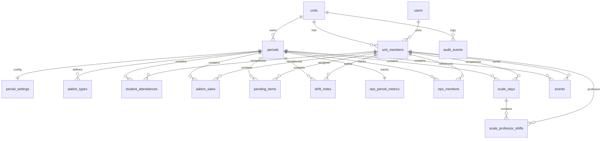

# BACKEND_CANONICO — Etapa 6

Data: 2026-04-22
Base de referência: `Docs/PROXIMOS_PASSOS.md` + `Docs/MAPA_ENTIDADES.md`
Objetivo: fixar o desenho canônico do backend antes da etapa de migrador.

## Escopo

Este documento fecha a Etapa 6 no nível de modelagem lógica. O foco aqui é:

- ERD lógico mínimo;
- papéis e regras de autorização;
- transações que precisam nascer atômicas;
- mapeamento entre o store local atual e o backend futuro.

Não define ainda:

- estratégia final de sincronização online-first/offline-first;
- tecnologia obrigatória de implementação;
- detalhes de fila offline ou replicação entre dispositivos.

## Decisões canônicas

- O backend é multiunidade; todo dado operacional pertence a uma `unit`.
- Identidade e vínculo são separados:
  - `users` representa identidade global/autenticação;
  - `unit_members` representa o vínculo do usuário com a unidade e seu papel local.
- Dados históricos preservam snapshots de nomes e rótulos, mesmo quando houver FK.
- Período é agregado central de quase todos os dados operacionais.
- Operações destrutivas ou compostas geram `audit_events`.
- O backend não migra estado efêmero de UI.
- O backend não depende de strings livres como fonte de verdade para pessoas; strings atuais viram snapshot histórico.

## ERD lógico mínimo

## Tabelas mínimas

### `units`

Propósito: unidade operacional do sistema.

Campos canônicos:

- `id uuid primary key`
- `name text not null`
- `slug text not null unique`
- `timezone text not null default 'America/Sao_Paulo'`
- `active boolean not null default true`
- `created_at timestamptz not null`
- `updated_at timestamptz not null`

### `users`

Propósito: identidade global/autenticação.

Campos canônicos:

- `id uuid primary key`
- `email text not null unique`
- `full_name text not null`
- `auth_provider text not null default 'supabase'`
- `active boolean not null default true`
- `created_at timestamptz not null`
- `updated_at timestamptz not null`

### `unit_members`

Propósito: vínculo do usuário com a unidade e papel local.

Campos canônicos:

- `id uuid primary key`
- `unit_id uuid not null references units(id)`
- `user_id uuid not null references users(id)`
- `display_name text not null`
- `role text not null check (role in ('admin', 'gestor', 'recepcao', 'professor', 'leitura'))`
- `active boolean not null default true`
- `created_at timestamptz not null`
- `updated_at timestamptz not null`

Constraints:

- `unique (unit_id, user_id)`

### `periods`

Propósito: agregado mensal por unidade.

Campos canônicos:

- `id uuid primary key`
- `unit_id uuid not null references units(id)`
- `period_key text not null`
- `label text not null`
- `status text not null check (status in ('open', 'closed'))`
- `closed_at timestamptz null`
- `closed_by_member_id uuid null references unit_members(id)`
- `created_at timestamptz not null`
- `updated_at timestamptz not null`

Constraints:

- `unique (unit_id, period_key)`

### `period_settings`

Propósito: configuração efetiva do período.

Campos canônicos:

- `id uuid primary key`
- `period_id uuid not null references periods(id)`
- `team_snapshot jsonb not null default '[]'::jsonb`
- `reception_snapshot jsonb not null default '[]'::jsonb`
- `professor_snapshot jsonb not null default '[]'::jsonb`
- `month_days integer not null`
- `created_by_member_id uuid null references unit_members(id)`
- `updated_by_member_id uuid null references unit_members(id)`
- `created_at timestamptz not null`
- `updated_at timestamptz not null`

Constraints:

- `unique (period_id)`

### `addon_types`

Propósito: catálogo de addons válido no período.

Campos canônicos:

- `id uuid primary key`
- `period_id uuid not null references periods(id)`
- `name text not null`
- `sort_order integer not null default 0`
- `active boolean not null default true`
- `created_at timestamptz not null`
- `updated_at timestamptz not null`

Constraints:

- `unique (period_id, name)`

### `student_attendances`

Propósito: atendimentos/alunos novos do período.

Campos canônicos:

- `id uuid primary key`
- `period_id uuid not null references periods(id)`
- `student_name text not null`
- `membership_number text null`
- `last_visit_date date null`
- `last_visit_time text null`
- `started_at_date date not null`
- `nps_notice_status text not null check (nps_notice_status in ('Sim', 'Não', 'Pendente'))`
- `receptionist_member_id uuid null references unit_members(id)`
- `receptionist_name_snapshot text null`
- `feedback_status text not null check (feedback_status in ('Respondeu', 'Não respondeu', 'Pendente'))`
- `addon_type_id uuid null references addon_types(id)`
- `addon_type_snapshot text null`
- `notes text not null default ''`
- `created_by_member_id uuid null references unit_members(id)`
- `updated_by_member_id uuid null references unit_members(id)`
- `created_at timestamptz not null`
- `updated_at timestamptz not null`

Índices mínimos:

- `(period_id)`
- `(membership_number)`
- `(receptionist_member_id)`
- `(started_at_date)`
- `(feedback_status)`

### `addon_sales`

Propósito: linha normalizada de venda de addon.

Campos canônicos:

- `id uuid primary key`
- `period_id uuid not null references periods(id)`
- `sale_date date not null`
- `receptionist_member_id uuid null references unit_members(id)`
- `receptionist_name_snapshot text null`
- `addon_type_id uuid null references addon_types(id)`
- `addon_type_snapshot text null`
- `quantity integer not null check (quantity >= 0)`
- `source text not null check (source in ('manual', 'student_attendance'))`
- `student_attendance_id uuid null references student_attendances(id)`
- `created_by_member_id uuid null references unit_members(id)`
- `updated_by_member_id uuid null references unit_members(id)`
- `created_at timestamptz not null`
- `updated_at timestamptz not null`

Constraints:

- `unique (period_id, sale_date, receptionist_member_id, addon_type_id, source, student_attendance_id)`

### `pending_items`

Propósito: pendências operacionais do período.

Campos canônicos:

- `id uuid primary key`
- `period_id uuid not null references periods(id)`
- `student_name text not null`
- `membership_number text null`
- `description text not null`
- `requested_at_date date not null`
- `assignee_member_id uuid null references unit_members(id)`
- `assignee_name_snapshot text null`
- `response text not null default ''`
- `status text not null check (status in ('aberto', 'respondido', 'concluido'))`
- `created_by_member_id uuid null references unit_members(id)`
- `updated_by_member_id uuid null references unit_members(id)`
- `created_at timestamptz not null`
- `updated_at timestamptz not null`

Índices mínimos:

- `(period_id)`
- `(status)`
- `(requested_at_date)`
- `(assignee_member_id)`
- `(membership_number)`

### `shift_notes`

Propósito: recados operacionais.

Campos canônicos:

- `id uuid primary key`
- `period_id uuid not null references periods(id)`
- `from_member_id uuid null references unit_members(id)`
- `from_name_snapshot text not null`
- `to_member_id uuid null references unit_members(id)`
- `to_audience text not null`
- `message text not null`
- `created_by_member_id uuid null references unit_members(id)`
- `created_at timestamptz not null`

Decisão canônica:

- o campo `read` global do modelo local não será levado como fonte de verdade;
- a leitura por usuário será resolvida no backend em uma estrutura derivada posterior, sem bloquear a tabela mínima desta etapa.

### `nps_period_metrics`

Propósito: métricas agregadas de NPS do período.

Campos canônicos:

- `id uuid primary key`
- `period_id uuid not null references periods(id)`
- `score numeric(5,2) not null`
- `monthly_goal numeric(5,2) not null`
- `semester_goal numeric(5,2) not null`
- `observations text not null default ''`
- `updated_by_member_id uuid null references unit_members(id)`
- `updated_at timestamptz not null`

Constraints:

- `unique (period_id)`

### `nps_mentions`

Propósito: menções/ranking de NPS por período.

Campos canônicos:

- `id uuid primary key`
- `period_id uuid not null references periods(id)`
- `employee_member_id uuid null references unit_members(id)`
- `name_snapshot text not null`
- `count integer not null check (count >= 0)`
- `rank_position integer null`
- `updated_by_member_id uuid null references unit_members(id)`
- `updated_at timestamptz not null`

Índices mínimos:

- `(period_id)`
- `(employee_member_id)`
- `(rank_position)`

### `scale_days`

Propósito: cabeçalho diário da escala.

Campos canônicos:

- `id uuid primary key`
- `period_id uuid not null references periods(id)`
- `scale_date date not null`
- `row_tone text not null check (row_tone in ('green', 'red', 'neutral'))`
- `reception_time text null`
- `receptionist_member_id uuid null references unit_members(id)`
- `receptionist_name_snapshot text null`
- `reception_swap text null`
- `note text not null default ''`
- `created_by_member_id uuid null references unit_members(id)`
- `updated_by_member_id uuid null references unit_members(id)`
- `created_at timestamptz not null`
- `updated_at timestamptz not null`

Constraints:

- `unique (period_id, scale_date)`

### `scale_professor_shifts`

Propósito: turnos de professor vinculados ao dia de escala.

Campos canônicos:

- `id uuid primary key`
- `scale_day_id uuid not null references scale_days(id)`
- `time_label text not null`
- `professor_member_id uuid null references unit_members(id)`
- `professor_name_snapshot text null`
- `swap_name_snapshot text null`
- `sort_order integer not null default 0`
- `created_at timestamptz not null`
- `updated_at timestamptz not null`

### `events`

Propósito: agenda de eventos/ações/campanhas.

Campos canônicos:

- `id uuid primary key`
- `period_id uuid not null references periods(id)`
- `event_date date not null`
- `event_time text null`
- `type text not null`
- `title text not null`
- `place text not null default ''`
- `owner_member_id uuid null references unit_members(id)`
- `owner_name_snapshot text null`
- `status text not null check (status in ('Programado', 'Confirmado', 'Concluído', 'Cancelado'))`
- `description text not null default ''`
- `created_by_member_id uuid null references unit_members(id)`
- `updated_by_member_id uuid null references unit_members(id)`
- `created_at timestamptz not null`
- `updated_at timestamptz not null`

Índices mínimos:

- `(period_id)`
- `(event_date)`
- `(type)`
- `(status)`

### `audit_events`

Propósito: trilha de auditoria para mutações críticas.

Campos canônicos:

- `id uuid primary key`
- `unit_id uuid not null references units(id)`
- `period_id uuid null references periods(id)`
- `actor_member_id uuid null references unit_members(id)`
- `event_type text not null`
- `entity_type text not null`
- `entity_id uuid null`
- `payload jsonb not null default '{}'::jsonb`
- `created_at timestamptz not null`

Eventos mínimos obrigatórios:

- `backup-export`
- `backup-import`
- `close-month`
- `reset-month`
- `member-rename`
- `attendance-addon-link`
- `delete-student-attendance`
- `delete-pending-item`
- `delete-event`

## Regras de autorização

### Princípios

- Toda leitura operacional exige autenticação e `unit_members.active = true`.
- Toda escrita operacional exige vínculo ativo na unidade.
- Operações destrutivas geram auditoria obrigatória.
- Dados históricos fechados podem ser lidos, mas não alterados por papéis operacionais comuns.

### Matriz canônica

| Ação | admin | gestor | recepcao | professor | leitura |
|---|---|---|---|---|---|
| Ler dados da unidade | sim | sim | sim | sim | sim |
| Editar unidade e membros | sim | não | não | não | não |
| Criar/editar período aberto | sim | sim | não | não | não |
| Fechar mês | sim | sim | não | não | não |
| Resetar mês | sim | sim | não | não | não |
| Importar backup | sim | sim | não | não | não |
| Exportar backup | sim | sim | não | não | não |
| Editar configurações do período | sim | sim | não | não | não |
| CRUD de atendimentos | sim | sim | sim | não | não |
| CRUD manual de addons | sim | sim | sim | não | não |
| CRUD de pendências | sim | sim | sim | não | não |
| CRUD de recados | sim | sim | sim | sim | não |
| CRUD de NPS | sim | sim | não | não | não |
| CRUD de escala | sim | sim | não | não | não |
| CRUD de eventos | sim | sim | não | não | não |
| Ler auditoria | sim | sim | não | não | não |

Decisão canônica de v1:

- não haverá matriz fina por permissão customizada;
- a distinção operacional será feita apenas pelos cinco papéis do roadmap;
- exceções futuras só entram em uma etapa posterior, sem alterar a base desta modelagem.

## Transações obrigatórias

### 1. Importação de backup

Objetivo: substituir ou restaurar dados do store local com atomicidade por unidade.

Passos atômicos:

1. Validar schema do arquivo e `kind`.
2. Validar pertencimento da unidade alvo.
3. Registrar auditoria preliminar de intenção.
4. Upsert de `periods`.
5. Recriar `period_settings`, `addon_types`, `student_attendances`, `addon_sales`, `pending_items`, `shift_notes`, `nps_period_metrics`, `nps_mentions`, `scale_days`, `scale_professor_shifts` e `events` do escopo importado.
6. Confirmar `audit_events` final.

Garantia:

- ou todo o lote entra;
- ou nada é persistido.

### 2. Fechamento de mês

Objetivo: congelar um período aberto.

Passos atômicos:

1. Confirmar que o período está `open`.
2. Validar integridade mínima do período.
3. Persistir backup/export lógico do período em payload de auditoria.
4. Atualizar `periods.status = 'closed'`, `closed_at` e `closed_by_member_id`.
5. Registrar `audit_events`.

Garantia:

- o período nunca pode ficar semiestado entre aberto e fechado.

### 3. Reset de mês

Objetivo: limpar dados operacionais preservando a configuração do período.

Passos atômicos:

1. Validar que o ator tem permissão.
2. Persistir backup lógico do período antes da limpeza.
3. Remover `student_attendances`, `addon_sales`, `pending_items`, `shift_notes`, `nps_period_metrics`, `nps_mentions`, `scale_days`, `scale_professor_shifts` e `events` do período.
4. Preservar `period_settings` e `addon_types`.
5. Registrar `audit_events`.

Garantia:

- reset nunca apaga configuração-base do período;
- reset sem backup prévio é inválido.

### 4. Renomeação de membro

Objetivo: renomear a pessoa sem corromper histórico.

Passos atômicos:

1. Atualizar `unit_members.display_name`.
2. Não reescrever snapshots históricos existentes.
3. Registrar `audit_events` com nome anterior e novo.

Garantia:

- histórico permanece legível e imutável;
- só dados futuros passam a usar o nome novo como default.

### 5. Atendimento com addon vinculado

Objetivo: manter coerência entre atendimento e venda de addon derivada.

Passos atômicos:

1. Criar ou atualizar `student_attendances`.
2. Criar, atualizar ou remover a linha correspondente em `addon_sales` com `source = 'student_attendance'`.
3. Registrar `audit_events`.

Garantia:

- atendimento e venda derivada não podem divergir ao final da transação.

## Mapeamento local -> backend

| Origem local | Destino canônico |
|---|---|
| `store.periods[YYYY-MM]` | `periods` |
| `settings` | `period_settings` |
| `settings.addonTypes` | `addon_types` |
| `students[]` | `student_attendances` |
| `addons[recepcionista][tipo][dia]` | `addon_sales` |
| `pending[]` | `pending_items` |
| `recados[]` + `wpm_recados_${YYYY-MM}` | `shift_notes` |
| `nps.score/goals/observations` | `nps_period_metrics` |
| `nps.mentions[]` + `rankSnapshot` | `nps_mentions` |
| `scale[]` | `scale_days` + `scale_professor_shifts` |
| `events[]` | `events` |
| export/import/reset/close | `audit_events` |

## Regras de migração já decididas

- Ler IndexedDB primeiro; usar localStorage apenas como fallback controlado.
- Consolidar recados legados antes da escrita backend.
- Preservar snapshots de nomes em todas as entidades históricas.
- Não migrar `controle_recepcao_app_ui_*` como dado operacional.
- Não confiar em `read` global de recado como contrato multiusuário.
- Datas de negócio seguem calendário local da unidade, com timezone explícito.

## Critério de pronto da Etapa 6

Esta etapa pode ser considerada pronta quando:

- o ERD lógico acima for a referência única do backend;
- papéis e ações proibidas/permitidas estiverem aceitos;
- transações obrigatórias forem implementadas respeitando esta modelagem;
- a Etapa 7 usar este documento como contrato de migrador.
