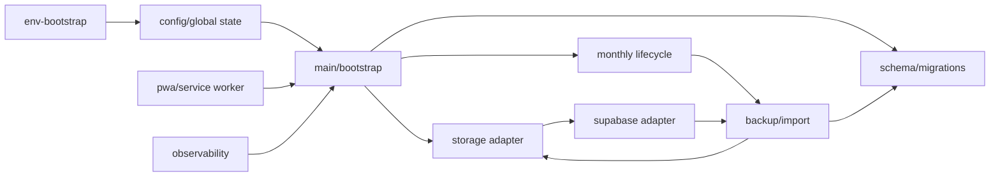
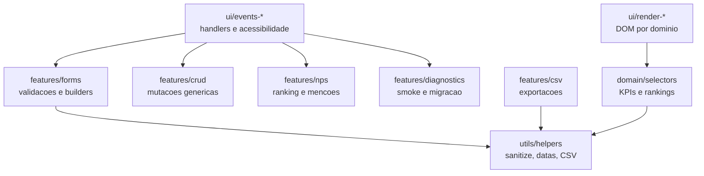
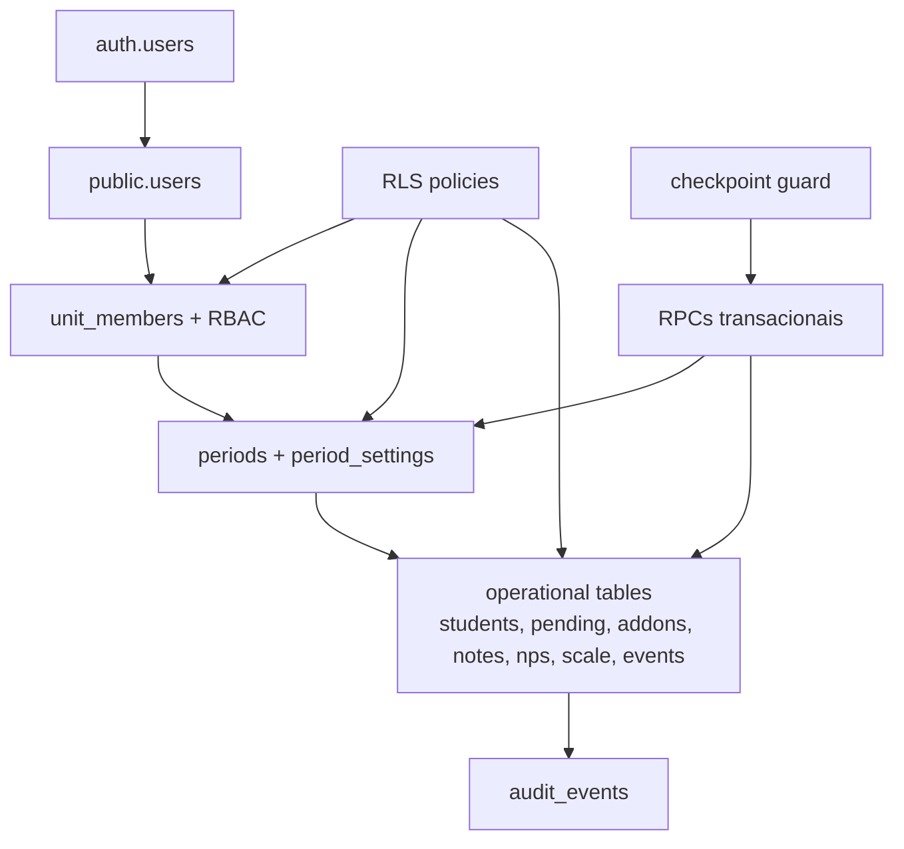

# Architect — C4 Componentes

Gerado em: 2026-05-02T17:46:12Z

## Componentes do Core SPA

## Componentes de Produto

## Componentes Supabase

## Componentes Criticos

| Componente | Motivo |
|---|---|
| `src/core/storage.js` | Sem ele nao ha continuidade local, fallback nem sync cross-tab. |
| `src/core/schema.js` | Define compatibilidade e saneamento do store. |
| `src/core/lifecycle.js` | Governa fechamento, reset e bloqueio do mes. |
| `src/core/supabase.js` | Ponte local-remoto e controle de conflito. |
| `supabase/migrations/*` | Contrato remoto canonico, RLS e RPCs. |
| `index.html` | Ordem de scripts e CSP sao contrato de runtime. |
| `sw.js` | Cache/update pode preservar ou quebrar releases. |
