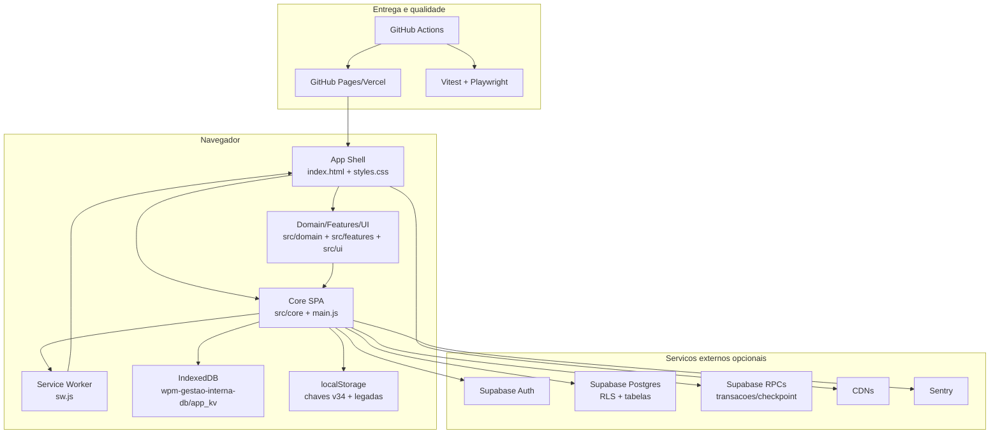

# Architect — C4 Containers

Gerado em: 2026-05-02T17:46:12Z

## Contratos Entre Containers

| Contrato | Formato | Dono |
|---|---|---|
| Store local | JSON `AppStore` versionado | `src/core/schema.js` |
| Periodo local | JSON `PeriodData` | `src/core/lifecycle.js` |
| Backup | JSON `app-backup`, `month-archive`, legado | `src/core/backup.js` |
| Supabase payload | JSON backup enviado para RPC | `src/core/supabase.js` |
| Checkpoint | JSON `revision`, `maxUpdatedAt`, contagens | SQL `get_unit_sync_checkpoint` |
| Cache PWA | Cache API com manifest versionado | `sw.js` |
