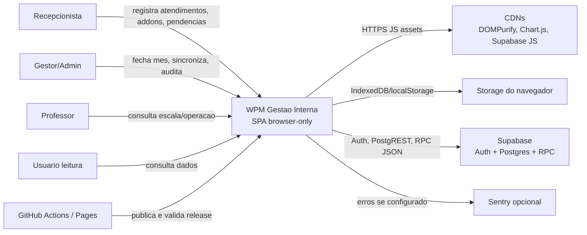

# Architect — C4 Contexto

Gerado em: 2026-05-02T17:46:12Z

## Relacoes

| Origem | Destino | Relacao | Confianca |
|---|---|---|---|
| Usuario operacional | SPA | Usa UI de recepcao, dashboard, pendencias, NPS, escala e eventos. | CONFIRMADO |
| SPA | Storage navegador | Persiste store local-first. | CONFIRMADO |
| SPA | Supabase | Login, leitura remota e sync guardada. | CONFIRMADO |
| SPA | CDNs | Carrega libs runtime. | CONFIRMADO |
| SPA | Sentry | Observabilidade opcional por env. | CONFIRMADO |
| GitHub Actions/Pages | SPA | CI e publicacao estatica. | CONFIRMADO |
