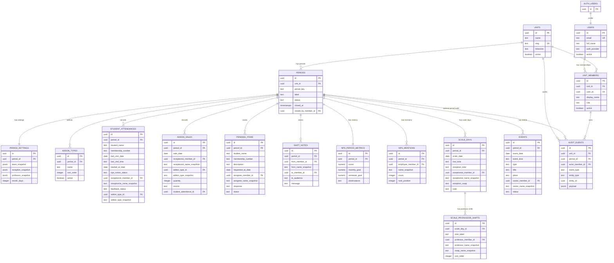

# Data Master — ERD

Gerado em: 2026-05-02T17:38:13Z

🟢 **CONFIRMADO** — Diagrama derivado das migrations Supabase.

```mermaid
erDiagram
  AUTH_USERS ||--|| USERS : "profile"
  USERS ||--o{ UNIT_MEMBERS : "has memberships"
  UNITS ||--o{ UNIT_MEMBERS : "has members"
  UNITS ||--o{ PERIODS : "has periods"
  PERIODS ||--|| PERIOD_SETTINGS : "has settings"
  PERIODS ||--o{ ADDON_TYPES : "defines"
  PERIODS ||--o{ STUDENT_ATTENDANCES : "records"
  PERIODS ||--o{ ADDON_SALES : "records"
  PERIODS ||--o{ PENDING_ITEMS : "tracks"
  PERIODS ||--o{ SHIFT_NOTES : "stores"
  PERIODS ||--|| NPS_PERIOD_METRICS : "has metrics"
  PERIODS ||--o{ NPS_MENTIONS : "has mentions"
  PERIODS ||--o{ SCALE_DAYS : "has scale days"
  SCALE_DAYS ||--o{ SCALE_PROFESSOR_SHIFTS : "has professor shifts"
  PERIODS ||--o{ EVENTS : "has events"
  UNITS ||--o{ AUDIT_EVENTS : "audits"
  PERIODS ||--o{ AUDIT_EVENTS : "optional period audit"
  UNIT_MEMBERS ||--o{ AUDIT_EVENTS : "actor"

  AUTH_USERS {
    uuid id PK
  }

  USERS {
    uuid id PK
    text email UK
    text full_name
    text auth_provider
    boolean active
  }

  UNITS {
    uuid id PK
    text name
    text slug UK
    text timezone
    boolean active
  }

  UNIT_MEMBERS {
    uuid id PK
    uuid unit_id FK
    uuid user_id FK
    text display_name
    text role
    boolean active
  }

  PERIODS {
    uuid id PK
    uuid unit_id FK
    text period_key
    text label
    text status
    timestamptz closed_at
    uuid closed_by_member_id FK
  }

  PERIOD_SETTINGS {
    uuid id PK
    uuid period_id FK
    jsonb team_snapshot
    jsonb reception_snapshot
    jsonb professor_snapshot
    integer month_days
  }

  ADDON_TYPES {
    uuid id PK
    uuid period_id FK
    text name
    integer sort_order
    boolean active
  }

  STUDENT_ATTENDANCES {
    uuid id PK
    uuid period_id FK
    text student_name
    text membership_number
    date last_visit_date
    text last_visit_time
    date started_at_date
    text nps_notice_status
    uuid receptionist_member_id FK
    text receptionist_name_snapshot
    text feedback_status
    uuid addon_type_id FK
    text addon_type_snapshot
  }

  ADDON_SALES {
    uuid id PK
    uuid period_id FK
    date sale_date
    uuid receptionist_member_id FK
    text receptionist_name_snapshot
    uuid addon_type_id FK
    text addon_type_snapshot
    integer quantity
    text source
    uuid student_attendance_id FK
  }

  PENDING_ITEMS {
    uuid id PK
    uuid period_id FK
    text student_name
    text membership_number
    text description
    date requested_at_date
    uuid assignee_member_id FK
    text assignee_name_snapshot
    text response
    text status
  }

  SHIFT_NOTES {
    uuid id PK
    uuid period_id FK
    uuid from_member_id FK
    text from_name_snapshot
    uuid to_member_id FK
    text to_audience
    text message
  }

  NPS_PERIOD_METRICS {
    uuid id PK
    uuid period_id FK
    numeric score
    numeric monthly_goal
    numeric semester_goal
    text observations
  }

  NPS_MENTIONS {
    uuid id PK
    uuid period_id FK
    uuid employee_member_id FK
    text name_snapshot
    integer count
    integer rank_position
  }

  SCALE_DAYS {
    uuid id PK
    uuid period_id FK
    date scale_date
    text row_tone
    text reception_time
    uuid receptionist_member_id FK
    text receptionist_name_snapshot
    text reception_swap
    text note
  }

  SCALE_PROFESSOR_SHIFTS {
    uuid id PK
    uuid scale_day_id FK
    text time_label
    uuid professor_member_id FK
    text professor_name_snapshot
    text swap_name_snapshot
    integer sort_order
  }

  EVENTS {
    uuid id PK
    uuid period_id FK
    date event_date
    text event_time
    text type
    text title
    text place
    uuid owner_member_id FK
    text owner_name_snapshot
    text status
  }

  AUDIT_EVENTS {
    uuid id PK
    uuid unit_id FK
    uuid period_id FK
    uuid actor_member_id FK
    text event_type
    text entity_type
    uuid entity_id
    jsonb payload
  }
```
