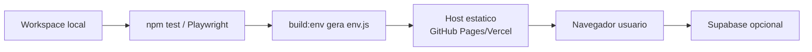
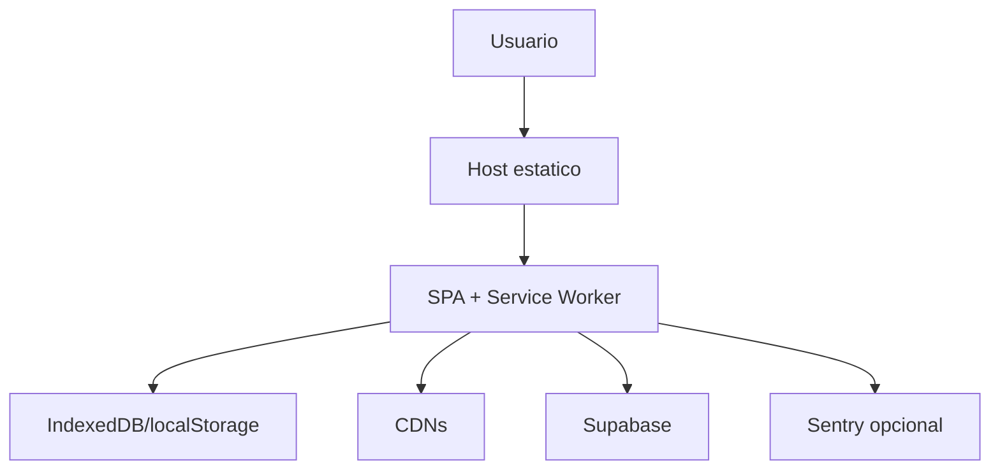

# Architect — Deployment

Gerado em: 2026-05-02T17:46:12Z

## Superficie de Deploy

| Item | Arquivo | Papel |
|---|---|---|
| App estatico | `index.html`, `styles.css`, `src/**/*.js`, `sw.js`, `manifest.json` | Runtime publicado. |
| Ambiente browser | `env.example.js`, `env.js`, `Scripts/generate-env.mjs` | Configura Supabase/Sentry/build metadata. |
| Supabase local/remoto | `supabase/config.toml`, `supabase/migrations/*`, `supabase/seed.sql` | Backend opcional. |
| Headers seguranca | `vercel.json` | Headers de deploy Vercel. |
| CI | `.github/workflows/ci.yml` | Testes, coverage, e2e/visual/smoke. |
| PWA | `sw.js`, `src/core/pwa.js`, `manifest.json`, `icons/` | Cache app shell e instalabilidade. |

## Fluxo de Publicacao

## Topologia Runtime

## Observacoes

- Nao ha Dockerfile ou docker-compose no estado analisado.
- Supabase tem stack local configurada por `supabase/config.toml`, com Postgres local, Studio e seed.
- O app pode operar sem Supabase; nesse modo o deploy estatico entrega a experiencia local-first.
- `env.js` nao deve ser cacheado pelo service worker.
- CDNs sao tratadas como network-only no service worker.
- Smoke de deploy existe via `npm run smoke:deploy`.

## Riscos de Deploy

| Risco | Mitigacao existente |
|---|---|
| Cache antigo preso no navegador | `sw.js` versiona cache por manifest/hash e limpa caches antigos. |
| Config publica ausente | `env-bootstrap.js` cria defaults seguros e app cai para local. |
| Supabase com dados remotos divergentes | checkpoint guardado bloqueia sync destrutiva. |
| CSP quebrar runtime | scripts inline foram removidos; CI/smoke deve validar. |
| CDN indisponivel | runtime de charts/sanitize pode degradar; app core continua local. |
