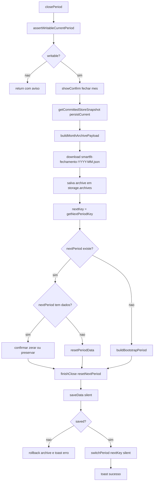

# Fluxograma por Função — `closePeriod`

```mermaid
flowchart TD
  A[closePeriod] --> B[assertWritableCurrentPeriod]
  B --> C{writable?}
  C -- nao --> D[return com aviso]
  C -- sim --> E[showConfirm fechar mes]
  E --> F[getCommittedStoreSnapshot persistCurrent]
  F --> G[buildMonthArchivePayload]
  G --> H[download smartfit-fechamento-YYYY-MM.json]
  H --> I[salva archive em storage.archives]
  I --> J[nextKey = getNextPeriodKey]
  J --> K{nextPeriod existe?}
  K -- nao --> L[buildBootstrapPeriod]
  K -- sim --> M{nextPeriod tem dados?}
  M -- sim --> N[confirmar zerar ou preservar]
  M -- nao --> O[resetPeriodData]
  N --> P[finishClose resetNextPeriod]
  O --> P
  L --> P
  P --> Q[saveData silent]
  Q --> R{saved?}
  R -- nao --> S[rollback archive e toast erro]
  R -- sim --> T[switchPeriod nextKey silent]
  T --> U[toast sucesso]
```
