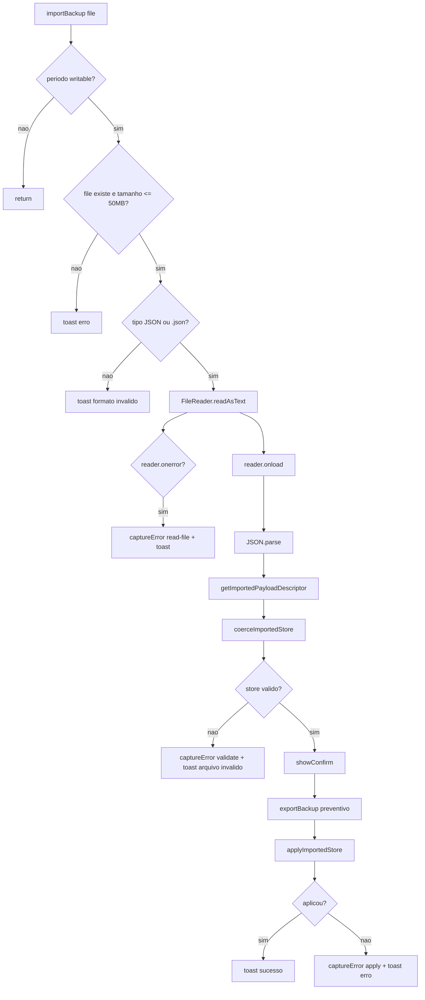

# Fluxograma por Função — `importBackup`

```mermaid
flowchart TD
  A[importBackup file] --> B{periodo writable?}
  B -- nao --> C[return]
  B -- sim --> D{file existe e tamanho <= 50MB?}
  D -- nao --> E[toast erro]
  D -- sim --> F{tipo JSON ou .json?}
  F -- nao --> G[toast formato invalido]
  F -- sim --> H[FileReader.readAsText]
  H --> I{reader.onerror?}
  I -- sim --> J[captureError read-file + toast]
  H --> K[reader.onload]
  K --> L[JSON.parse]
  L --> M[getImportedPayloadDescriptor]
  M --> N[coerceImportedStore]
  N --> O{store valido?}
  O -- nao --> P[captureError validate + toast arquivo invalido]
  O -- sim --> Q[showConfirm]
  Q --> R[exportBackup preventivo]
  R --> S[applyImportedStore]
  S --> T{aplicou?}
  T -- sim --> U[toast sucesso]
  T -- nao --> V[captureError apply + toast erro]
```
