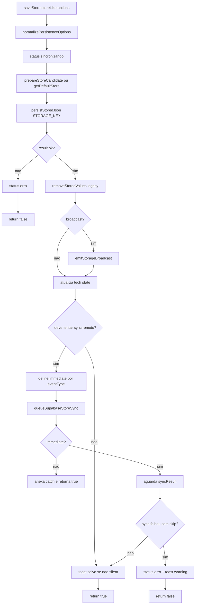

# Fluxograma por Função — `saveStore`

```mermaid
flowchart TD
  A[saveStore storeLike options] --> B[normalizePersistenceOptions]
  B --> C[status sincronizando]
  C --> D[prepareStoreCandidate ou getDefaultStore]
  D --> E[persistStoredJson STORAGE_KEY]
  E --> F{result.ok?}
  F -- nao --> G[status erro]
  G --> H[return false]
  F -- sim --> I[removeStoredValues legacy]
  I --> J{broadcast?}
  J -- sim --> K[emitStorageBroadcast]
  J -- nao --> L[atualiza tech state]
  K --> L
  L --> M{deve tentar sync remoto?}
  M -- nao --> N[toast salvo se nao silent]
  N --> O[return true]
  M -- sim --> P[define immediate por eventType]
  P --> Q[queueSupabaseStoreSync]
  Q --> R{immediate?}
  R -- nao --> S[anexa catch e retorna true]
  R -- sim --> T[aguarda syncResult]
  T --> U{sync falhou sem skip?}
  U -- sim --> V[status erro + toast warning]
  V --> W[return false]
  U -- nao --> N
```
