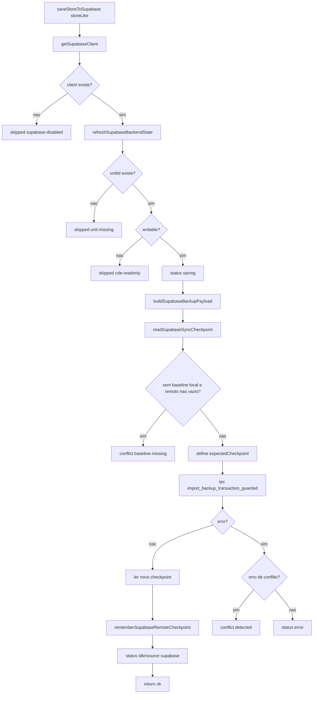

# Fluxograma por Função — `saveStoreToSupabase`

```mermaid
flowchart TD
  A[saveStoreToSupabase storeLike] --> B[getSupabaseClient]
  B --> C{client existe?}
  C -- nao --> D[skipped supabase-disabled]
  C -- sim --> E[refreshSupabaseBackendState]
  E --> F{unitId existe?}
  F -- nao --> G[skipped unit-missing]
  F -- sim --> H{writable?}
  H -- nao --> I[skipped role-readonly]
  H -- sim --> J[status saving]
  J --> K[buildSupabaseBackupPayload]
  K --> L[readSupabaseSyncCheckpoint]
  L --> M{sem baseline local e remoto nao vazio?}
  M -- sim --> N[conflict baseline-missing]
  M -- nao --> O[define expectedCheckpoint]
  O --> P[rpc import_backup_transaction_guarded]
  P --> Q{erro?}
  Q -- nao --> R[ler novo checkpoint]
  R --> S[rememberSupabaseRemoteCheckpoint]
  S --> T[status idle/source supabase]
  T --> U[return ok]
  Q -- sim --> V{erro de conflito?}
  V -- sim --> W[conflict detected]
  V -- nao --> X[status error]
```
