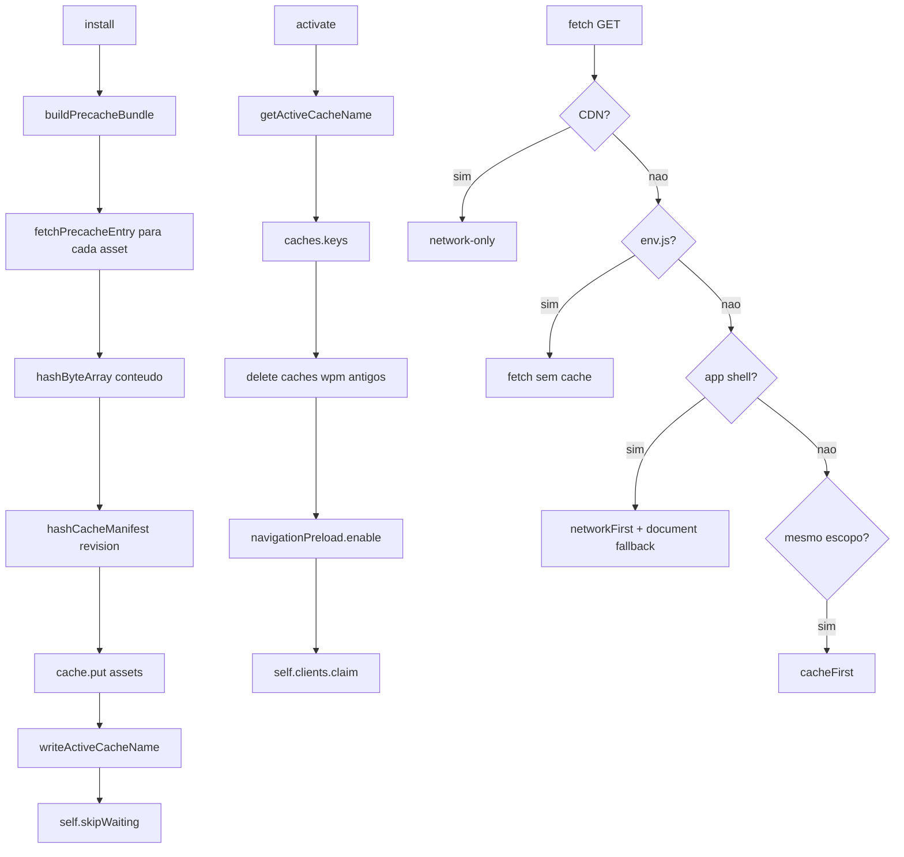

# Fluxograma por Função — Service Worker

```mermaid
flowchart TD
  A[install] --> B[buildPrecacheBundle]
  B --> C[fetchPrecacheEntry para cada asset]
  C --> D[hashByteArray conteudo]
  D --> E[hashCacheManifest revision]
  E --> F[cache.put assets]
  F --> G[writeActiveCacheName]
  G --> H[self.skipWaiting]

  I[activate] --> J[getActiveCacheName]
  J --> K[caches.keys]
  K --> L[delete caches wpm antigos]
  L --> M[navigationPreload.enable]
  M --> N[self.clients.claim]

  O[fetch GET] --> P{CDN?}
  P -- sim --> Q[network-only]
  P -- nao --> R{env.js?}
  R -- sim --> S[fetch sem cache]
  R -- nao --> T{app shell?}
  T -- sim --> U[networkFirst + document fallback]
  T -- nao --> V{mesmo escopo?}
  V -- sim --> W[cacheFirst]
```
