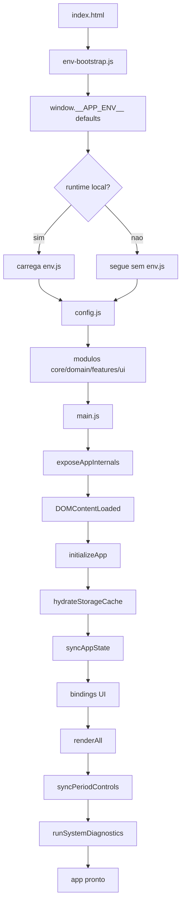
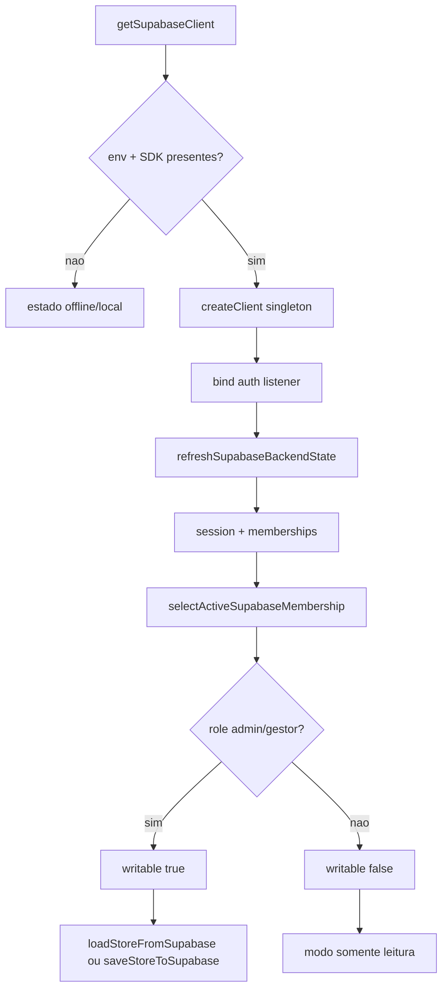

# Fluxograma — Módulo `src/core`

## Bootstrap Geral



## Persistência e Sincronização

```mermaid
flowchart TD
  A[mutacao de estado] --> B[saveData]
  B --> C[storage.periods[currentPeriodKey] = state]
  C --> D[saveStore]
  D --> E[prepareStoreCandidate]
  E --> F[persistStoredJson STORAGE_KEY]
  F --> G{IndexedDB disponivel?}
  G -- sim --> H[idbSetValue]
  H --> I[atualiza cache Map]
  I --> J[espelha localStorage]
  G -- nao --> K[localStorage primario]
  J --> L[remove legacy keys]
  K --> L
  L --> M{broadcast habilitado?}
  M -- sim --> N[emitStorageBroadcast]
  M -- nao --> O[continua]
  N --> P{Supabase autenticado e writable?}
  O --> P
  P -- sim --> Q[queueSupabaseStoreSync]
  P -- nao --> R[retorna salvo local]
  Q --> S{evento critico?}
  S -- sim --> T[saveStoreToSupabase imediato]
  S -- nao --> U[sync remoto debounced]
```

## Ciclo Mensal

```mermaid
flowchart TD
  A[closePeriod] --> B{periodo atual writable?}
  B -- nao --> C[toast bloqueio]
  B -- sim --> D[confirmar fechamento]
  D --> E[getCommittedStoreSnapshot]
  E --> F[buildMonthArchivePayload]
  F --> G[download fechamento JSON]
  G --> H[storage.archives[currentPeriodKey] = archive]
  H --> I[nextKey = getNextPeriodKey]
  I --> J{proximo mes tem dados?}
  J -- sim --> K[confirmar zerar ou preservar]
  J -- nao --> L[criar/resetar proximo periodo]
  K --> L
  L --> M[saveData]
  M --> N{salvou?}
  N -- nao --> O[rollback archive + toast erro]
  N -- sim --> P[switchPeriod nextKey]
  P --> Q[toast sucesso]
```

## Supabase Local-First


