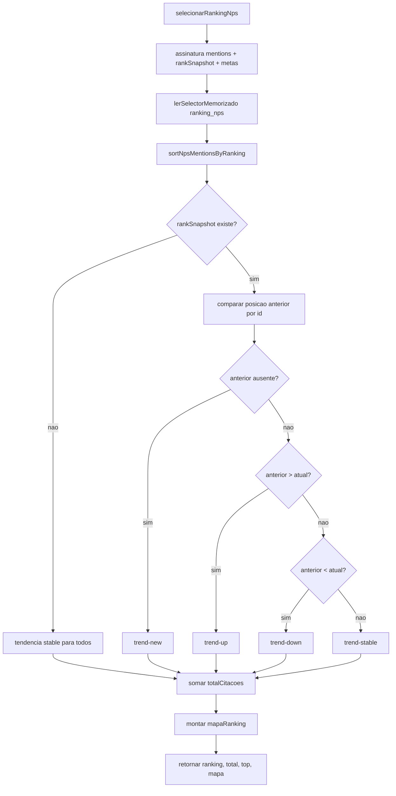

# Fluxograma por Função — `selecionarRankingNps`

```mermaid
flowchart TD
  A[selecionarRankingNps] --> B[assinatura mentions + rankSnapshot + metas]
  B --> C[lerSelectorMemorizado ranking_nps]
  C --> D[sortNpsMentionsByRanking]
  D --> E{rankSnapshot existe?}
  E -- nao --> F[tendencia stable para todos]
  E -- sim --> G[comparar posicao anterior por id]
  G --> H{anterior ausente?}
  H -- sim --> I[trend-new]
  H -- nao --> J{anterior > atual?}
  J -- sim --> K[trend-up]
  J -- nao --> L{anterior < atual?}
  L -- sim --> M[trend-down]
  L -- nao --> N[trend-stable]
  F --> O[somar totalCitacoes]
  I --> O
  K --> O
  M --> O
  N --> O
  O --> P[montar mapaRanking]
  P --> Q[retornar ranking, total, top, mapa]
```
