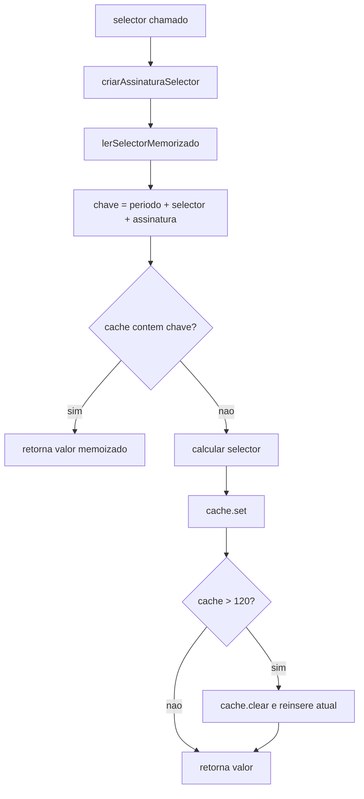
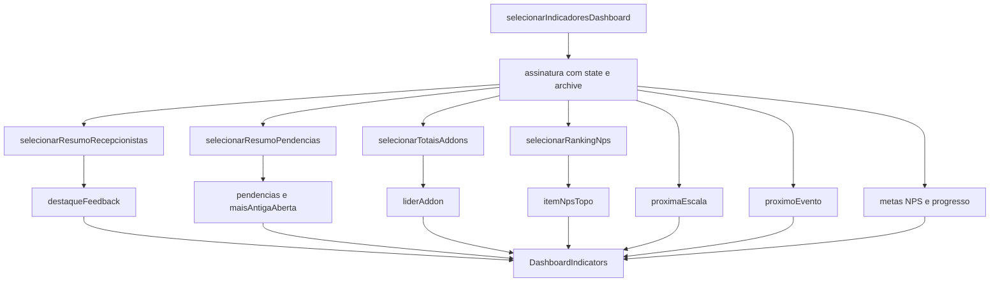

# Fluxograma — Módulo `src/domain`

## Selector Memoizado

```mermaid
flowchart TD
  A[selector chamado] --> B[criarAssinaturaSelector]
  B --> C[lerSelectorMemorizado]
  C --> D[chave = periodo + selector + assinatura]
  D --> E{cache contem chave?}
  E -- sim --> F[retorna valor memoizado]
  E -- nao --> G[calcular selector]
  G --> H[cache.set]
  H --> I{cache > 120?}
  I -- sim --> J[cache.clear e reinsere atual]
  I -- nao --> K[retorna valor]
  J --> K
```

## Indicadores do Dashboard

```mermaid
flowchart TD
  A[selecionarIndicadoresDashboard] --> B[assinatura com state e archive]
  B --> C[selecionarResumoRecepcionistas]
  B --> D[selecionarResumoPendencias]
  B --> E[selecionarTotaisAddons]
  B --> F[selecionarRankingNps]
  C --> G[destaqueFeedback]
  D --> H[pendencias e maisAntigaAberta]
  E --> I[liderAddon]
  F --> J[itemNpsTopo]
  B --> K[proximaEscala]
  B --> L[proximoEvento]
  B --> M[metas NPS e progresso]
  G --> N[DashboardIndicators]
  H --> N
  I --> N
  J --> N
  K --> N
  L --> N
  M --> N
```
