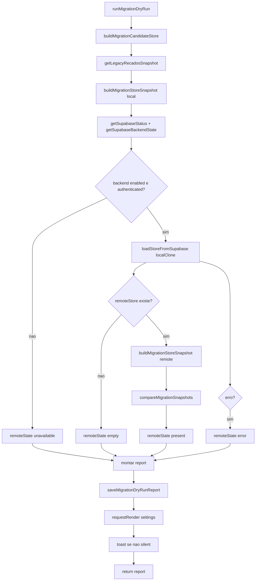

# Fluxograma por Função — `runMigrationDryRun`

```mermaid
flowchart TD
  A[runMigrationDryRun] --> B[buildMigrationCandidateStore]
  B --> C[getLegacyRecadosSnapshot]
  C --> D[buildMigrationStoreSnapshot local]
  D --> E[getSupabaseStatus + getSupabaseBackendState]
  E --> F{backend enabled e authenticated?}
  F -- nao --> G[remoteState unavailable]
  F -- sim --> H[loadStoreFromSupabase localClone]
  H --> I{remoteStore existe?}
  I -- nao --> J[remoteState empty]
  I -- sim --> K[buildMigrationStoreSnapshot remote]
  K --> L[compareMigrationSnapshots]
  L --> M[remoteState present]
  H --> N{erro?}
  N -- sim --> O[remoteState error]
  G --> P[montar report]
  J --> P
  M --> P
  O --> P
  P --> Q[saveMigrationDryRunReport]
  Q --> R[requestRender settings]
  R --> S[toast se nao silent]
  S --> T[return report]
```
