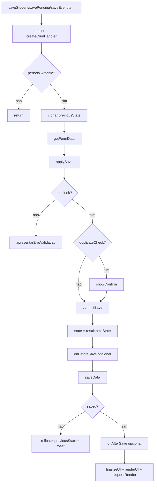
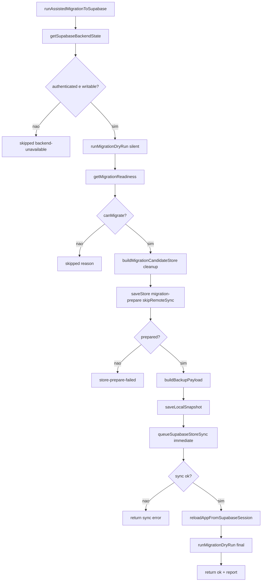

# Fluxograma — Módulo `src/features`

## CRUD Genérico

```mermaid
flowchart TD
  A[saveStudent/savePending/saveEventItem] --> B[handler de createCrudHandler]
  B --> C{periodo writable?}
  C -- nao --> D[return]
  C -- sim --> E[clonar previousState]
  E --> F[getFormData]
  F --> G[applySave]
  G --> H{result.ok?}
  H -- nao --> I[apresentarErroValidacao]
  H -- sim --> J{duplicateCheck?}
  J -- sim --> K[showConfirm]
  J -- nao --> L[commitSave]
  K --> L
  L --> M[state = result.nextState]
  M --> N[onBeforeSave opcional]
  N --> O[saveData]
  O --> P{saved?}
  P -- nao --> Q[rollback previousState + toast]
  P -- sim --> R[onAfterSave opcional]
  R --> S[finalizeUI + renderUI + requestRender]
```

## Migração Assistida

```mermaid
flowchart TD
  A[runAssistedMigrationToSupabase] --> B[getSupabaseBackendState]
  B --> C{authenticated e writable?}
  C -- nao --> D[skipped backend-unavailable]
  C -- sim --> E[runMigrationDryRun silent]
  E --> F[getMigrationReadiness]
  F --> G{canMigrate?}
  G -- nao --> H[skipped reason]
  G -- sim --> I[buildMigrationCandidateStore cleanup]
  I --> J[saveStore migration-prepare skipRemoteSync]
  J --> K{prepared?}
  K -- nao --> L[store-prepare-failed]
  K -- sim --> M[buildBackupPayload]
  M --> N[saveLocalSnapshot]
  N --> O[queueSupabaseStoreSync immediate]
  O --> P{sync ok?}
  P -- nao --> Q[return sync error]
  P -- sim --> R[reloadAppFromSupabaseSession]
  R --> S[runMigrationDryRun final]
  S --> T[return ok + report]
```
