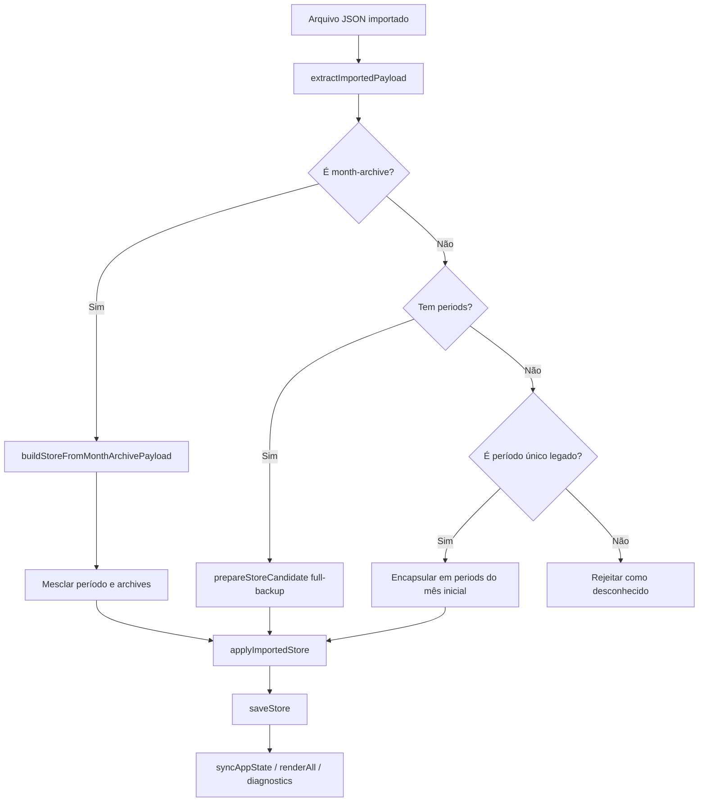

# Fluxograma — Importação de Payload Legado

## Regra

O legado aceita backup completo, fechamento mensal e payload de período único antigo, sempre passando por sanitização e normalização antes de persistir.
