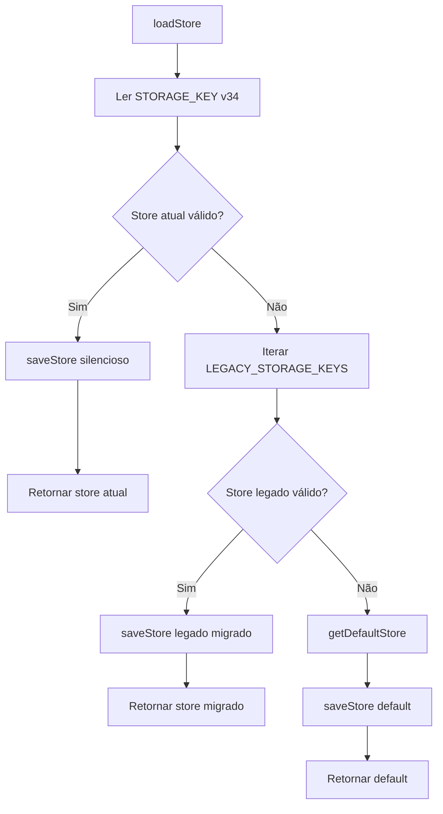

# Fluxograma — `loadStore` Legado

```mermaid
flowchart TD
  A[loadStore] --> B[Ler STORAGE_KEY v34]
  B --> C{Store atual válido?}
  C -- Sim --> D[saveStore silencioso]
  D --> E[Retornar store atual]
  C -- Não --> F[Iterar LEGACY_STORAGE_KEYS]
  F --> G{Store legado válido?}
  G -- Sim --> H[saveStore legado migrado]
  H --> I[Retornar store migrado]
  G -- Não --> J[getDefaultStore]
  J --> K[saveStore default]
  K --> L[Retornar default]
```

## Regra

O store legado é migrado para a chave atual quando encontrado e aceito por `prepareStoreCandidate`.
