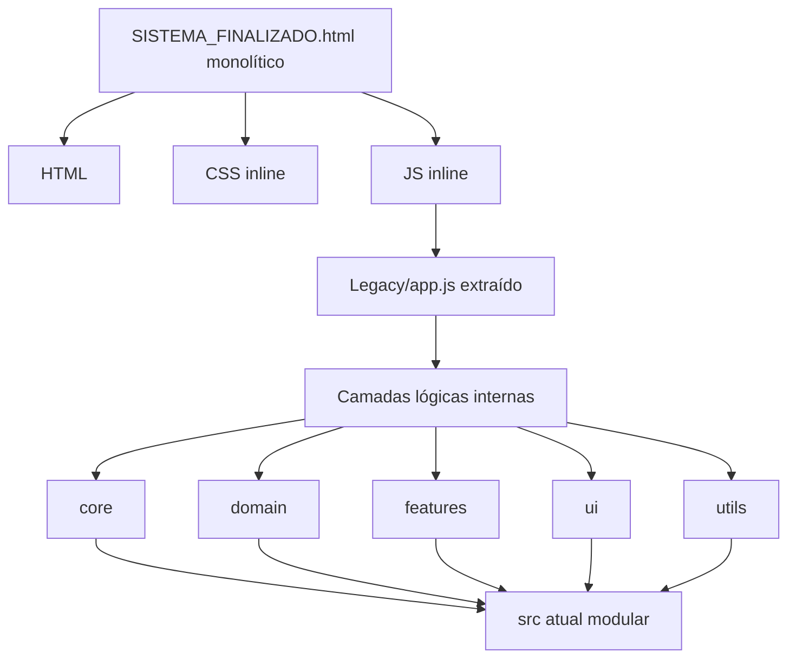

# Fluxograma — Módulo `Legacy`

## Evidências

- `Legacy/SISTEMA_FINALIZADO.html` contém HTML, CSS e JS embutidos.
- `Legacy/app.js` contém o comentário "Mapa da arquitetura" com 8 camadas internas.
- `index.html` atual carrega `src/**/*.js`, não arquivos de `Legacy`.
