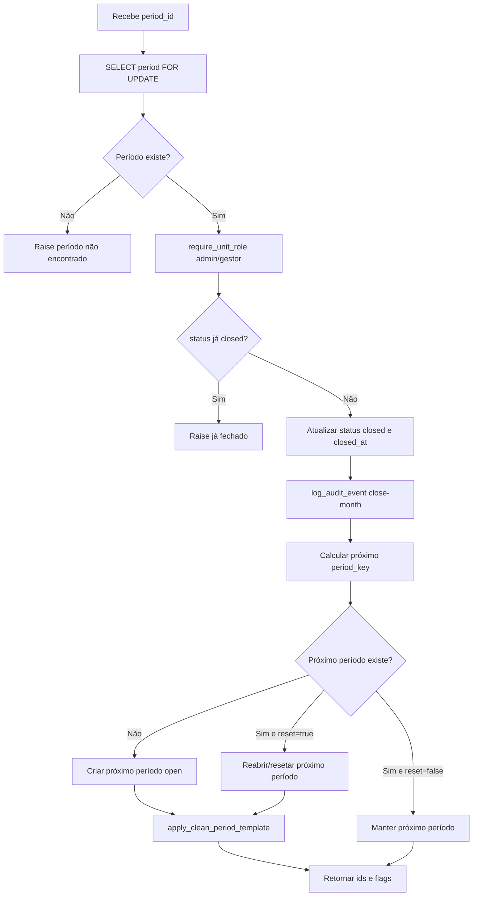

# Fluxograma — `close_period_transaction`

```mermaid
flowchart TD
  A[Recebe period_id] --> B[SELECT period FOR UPDATE]
  B --> C{Período existe?}
  C -- Não --> D[Raise período não encontrado]
  C -- Sim --> E[require_unit_role admin/gestor]
  E --> F{status já closed?}
  F -- Sim --> G[Raise já fechado]
  F -- Não --> H[Atualizar status closed e closed_at]
  H --> I[log_audit_event close-month]
  I --> J[Calcular próximo period_key]
  J --> K{Próximo período existe?}
  K -- Não --> L[Criar próximo período open]
  L --> M[apply_clean_period_template]
  K -- Sim e reset=true --> N[Reabrir/resetar próximo período]
  N --> M
  K -- Sim e reset=false --> O[Manter próximo período]
  M --> P[Retornar ids e flags]
  O --> P
```

## Regra

Fechamento de mês exige `admin` ou `gestor`, audita a operação e prepara o próximo mês com template limpo quando necessário.
