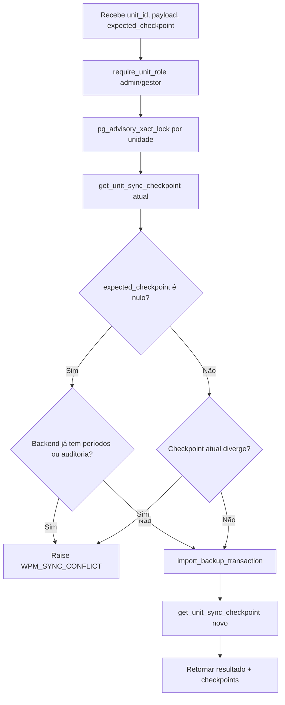

# Fluxograma — `import_backup_transaction_guarded`

```mermaid
flowchart TD
  A[Recebe unit_id, payload, expected_checkpoint] --> B[require_unit_role admin/gestor]
  B --> C[pg_advisory_xact_lock por unidade]
  C --> D[get_unit_sync_checkpoint atual]
  D --> E{expected_checkpoint é nulo?}
  E -- Sim --> F{Backend já tem períodos ou auditoria?}
  F -- Sim --> G[Raise WPM_SYNC_CONFLICT]
  F -- Não --> H[import_backup_transaction]
  E -- Não --> I{Checkpoint atual diverge?}
  I -- Sim --> G
  I -- Não --> H
  H --> J[get_unit_sync_checkpoint novo]
  J --> K[Retornar resultado + checkpoints]
```

## Regra

A importação guardada bloqueia sobrescrita remota quando o cliente não conhece o checkpoint atual do backend.
