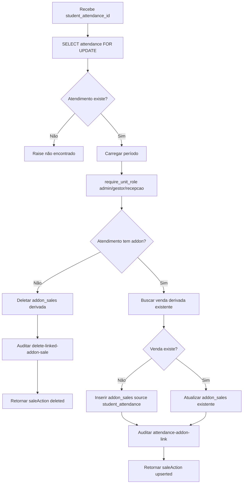

# Fluxograma — `link_student_attendance_addon_transaction`

## Regra

Venda de addon derivada de atendimento é mantida como linha única por atendimento e segue permissão de `admin`, `gestor` ou `recepcao`.
