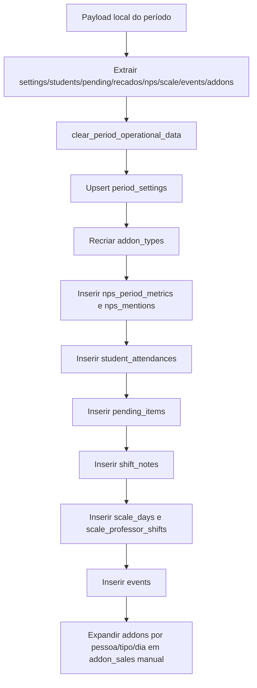

# Fluxograma — `replace_period_from_payload`

## Regra

O payload browser-only é substitutivo: antes de importar, os dados operacionais do período são limpos e reconstruídos em tabelas relacionais.
