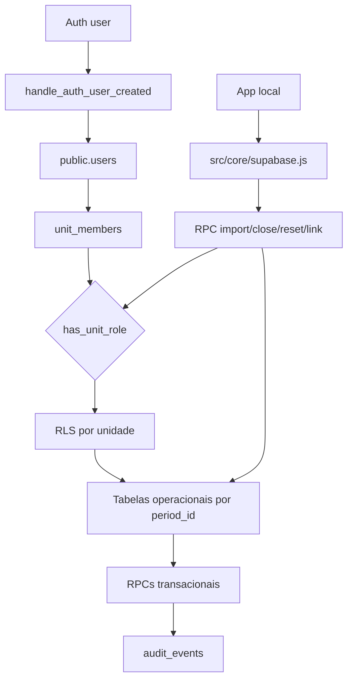

# Fluxograma — Módulo `supabase`

## Evidências

- `20260422190000_backend_canonical_schema.sql`: schema, RLS, triggers e policies.
- `20260422194000_backend_transaction_rpcs.sql`: RPCs transacionais.
- `20260423090000_sync_checkpoint_guard.sql`: guard de sincronização.
