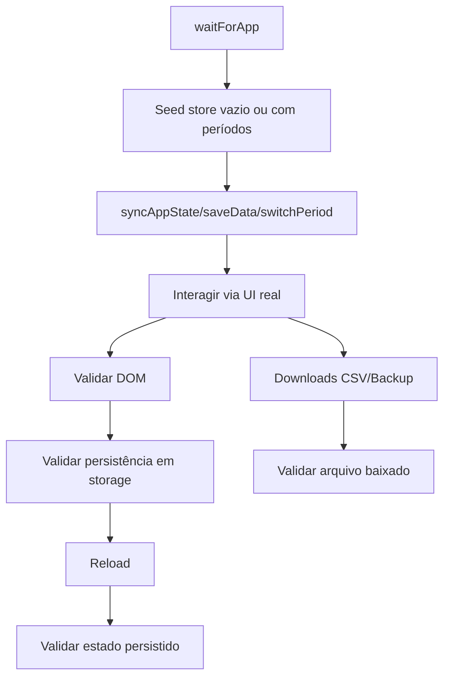

# Fluxograma — E2E Workflows

```mermaid
flowchart TD
  A[waitForApp] --> B[Seed store vazio ou com períodos]
  B --> C[syncAppState/saveData/switchPeriod]
  C --> D[Interagir via UI real]
  D --> E[Validar DOM]
  E --> F[Validar persistência em storage]
  F --> G[Reload]
  G --> H[Validar estado persistido]

  D --> I[Downloads CSV/Backup]
  I --> J[Validar arquivo baixado]
```

## Regra

Fluxos E2E validam comportamento completo de UI + persistência + reload, não apenas funções isoladas.
