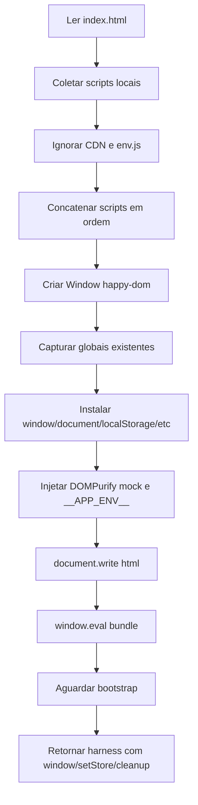

# Fluxograma — `loadRealApp`

```mermaid
flowchart TD
  A[Ler index.html] --> B[Coletar scripts locais]
  B --> C[Ignorar CDN e env.js]
  C --> D[Concatenar scripts em ordem]
  D --> E[Criar Window happy-dom]
  E --> F[Capturar globais existentes]
  F --> G[Instalar window/document/localStorage/etc]
  G --> H[Injetar DOMPurify mock e __APP_ENV__]
  H --> I[document.write html]
  I --> J[window.eval bundle]
  J --> K[Aguardar bootstrap]
  K --> L[Retornar harness com window/setStore/cleanup]
```

## Regra

O helper testa o app real sem bundler, preservando a ordem de scripts declarada em `index.html`.
