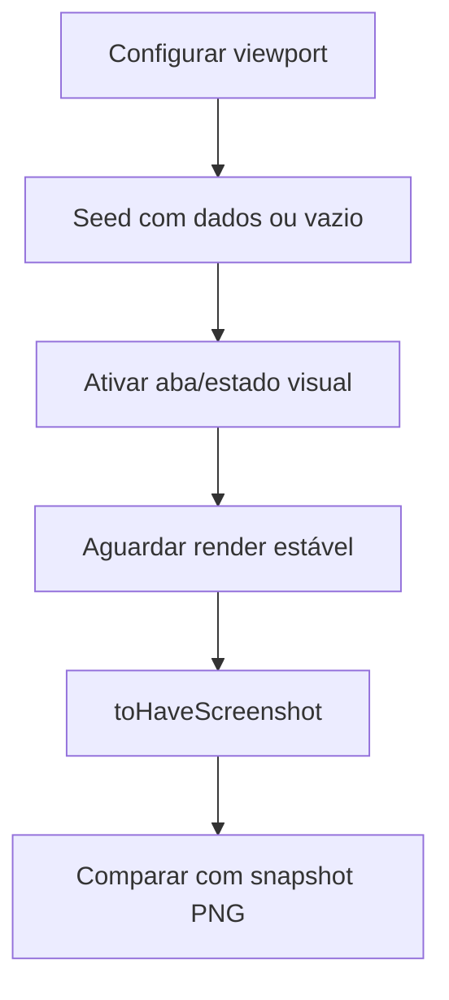

# Fluxograma — Regressão Visual

```mermaid
flowchart TD
  A[Configurar viewport] --> B[Seed com dados ou vazio]
  B --> C[Ativar aba/estado visual]
  C --> D[Aguardar render estável]
  D --> E[toHaveScreenshot]
  E --> F[Comparar com snapshot PNG]
```

## Regra

Snapshots visuais protegem estados principais por aba e viewport. Alterações de layout exigem atualização intencional dos PNGs.
