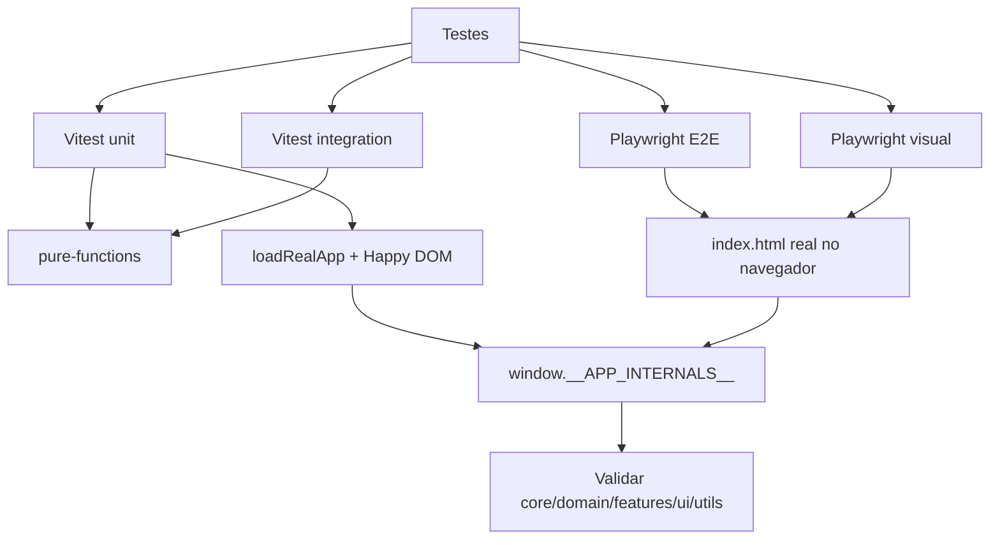

# Fluxograma — Módulo `tests`

## Evidências

- `vitest.config.js`: unit/integration em `happy-dom`.
- `playwright.config.js`: E2E em Chromium com servidor HTTP local.
- `tests/helpers/load-real-app.js`: carrega scripts reais do `index.html`.
