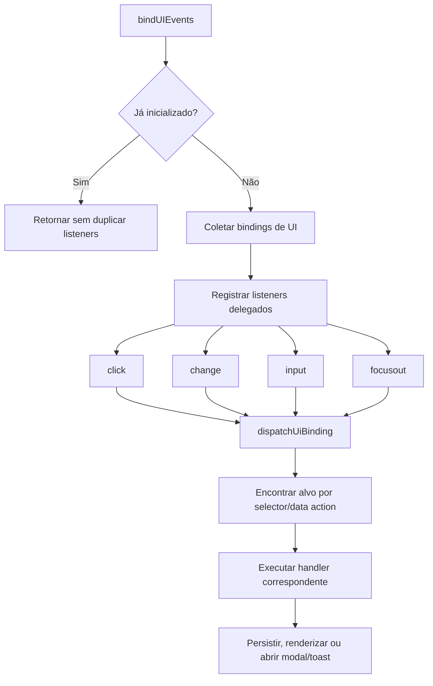

# Fluxograma — `bindUIEvents`

```mermaid
flowchart TD
  A[bindUIEvents] --> B{Já inicializado?}
  B -- Sim --> C[Retornar sem duplicar listeners]
  B -- Não --> D[Coletar bindings de UI]
  D --> E[Registrar listeners delegados]
  E --> F[click]
  E --> G[change]
  E --> H[input]
  E --> I[focusout]
  F --> J[dispatchUiBinding]
  G --> J
  H --> J
  I --> J
  J --> K[Encontrar alvo por selector/data action]
  K --> L[Executar handler correspondente]
  L --> M[Persistir, renderizar ou abrir modal/toast]
```

## Regra

Os listeners globais são idempotentes por `estadoEventos`, reduzindo risco de handlers duplicados em re-renderizações.
