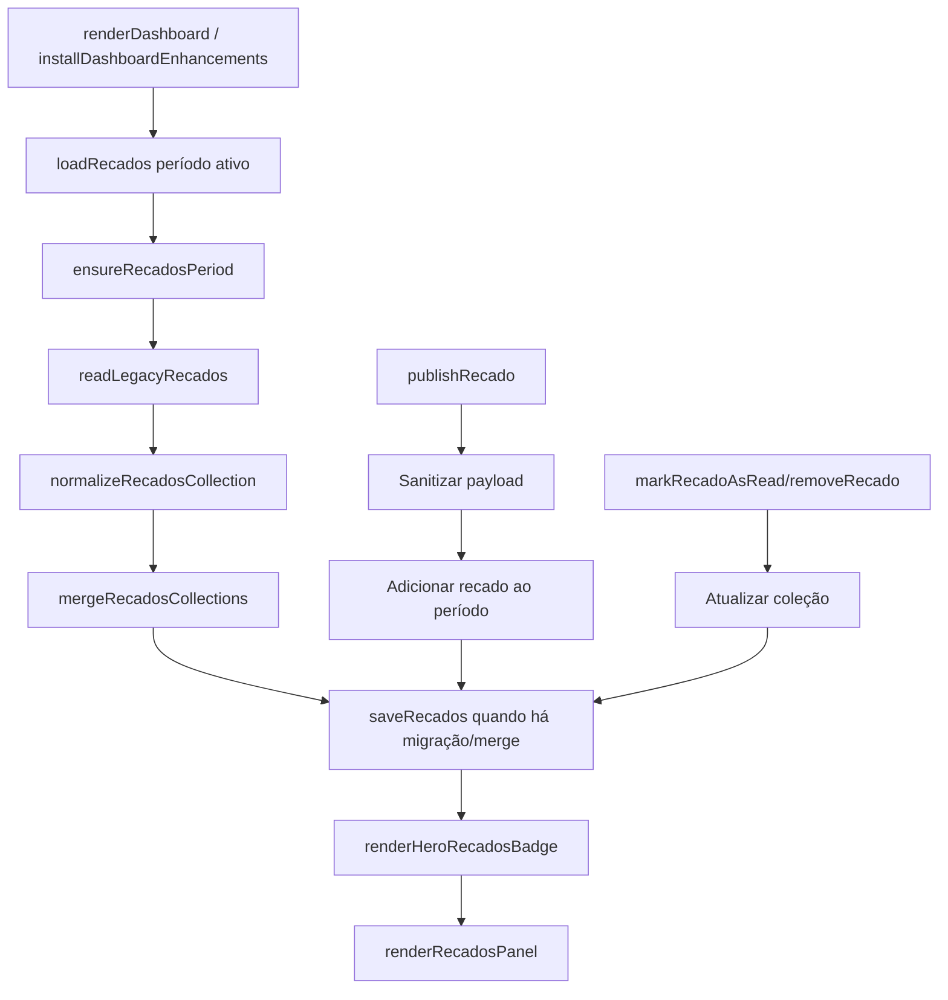

# Fluxograma — Recados no Dashboard

```mermaid
flowchart TD
  A[renderDashboard / installDashboardEnhancements] --> B[loadRecados período ativo]
  B --> C[ensureRecadosPeriod]
  C --> D[readLegacyRecados]
  D --> E[normalizeRecadosCollection]
  E --> F[mergeRecadosCollections]
  F --> G[saveRecados quando há migração/merge]
  G --> H[renderHeroRecadosBadge]
  H --> I[renderRecadosPanel]

  J[publishRecado] --> K[Sanitizar payload]
  K --> L[Adicionar recado ao período]
  L --> G

  M[markRecadoAsRead/removeRecado] --> N[Atualizar coleção]
  N --> G
```

## Regra

Recados antigos armazenados fora do store principal são normalizados e mesclados por período antes da renderização do badge e do painel.
