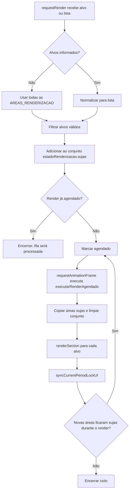

# Fluxograma — `requestRender`

```mermaid
flowchart TD
  A[requestRender recebe alvo ou lista] --> B{Alvos informados?}
  B -- Não --> C[Usar todas as AREAS_RENDERIZACAO]
  B -- Sim --> D[Normalizar para lista]
  C --> E[Filtrar alvos válidos]
  D --> E
  E --> F[Adicionar ao conjunto estadoRenderizacao.sujas]
  F --> G{Render já agendado?}
  G -- Sim --> H[Encerrar; fila será processada]
  G -- Não --> I[Marcar agendado]
  I --> J[requestAnimationFrame executa executarRenderAgendado]
  J --> K[Copiar áreas sujas e limpar conjunto]
  K --> L[renderSection para cada alvo]
  L --> M[syncCurrentPeriodLockUI]
  M --> N{Novas áreas ficaram sujas durante o render?}
  N -- Sim --> I
  N -- Não --> O[Encerrar ciclo]
```

## Regra

Renderizações são agregadas por frame e por área suja. Isso evita atualização completa da tela em cada evento de input ou clique.
