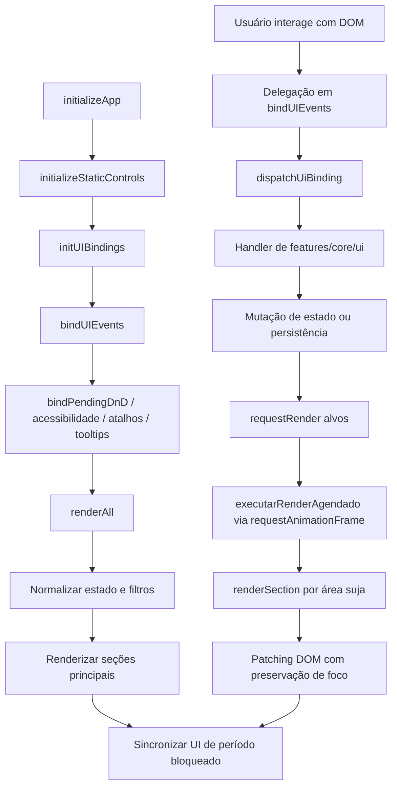

# Fluxograma — Módulo `src/ui`

## Evidências

- `src/ui/render-core.js`: `AREAS_RENDERIZACAO`, `RENDER_MAP`, `requestRender`, `executarRenderAgendado`, `renderAll`.
- `src/ui/events-core.js`: `bindUIEvents`, `collectUiEventBindings`, `dispatchUiBinding`, controles globais.
