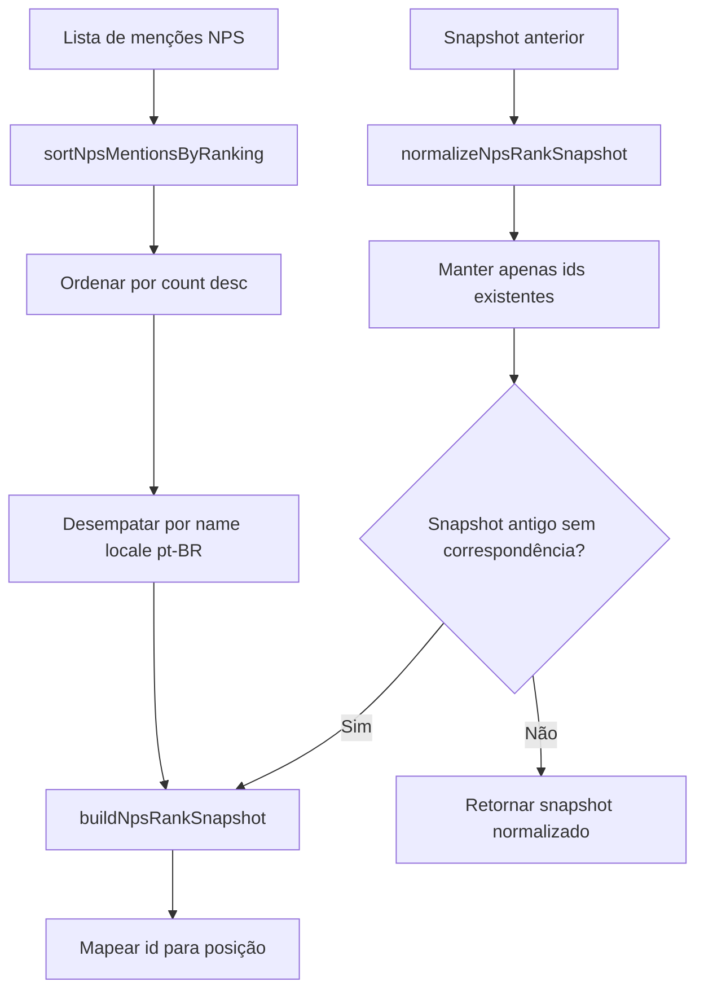

# Fluxograma — Ranking NPS

```mermaid
flowchart TD
  A[Lista de menções NPS] --> B[sortNpsMentionsByRanking]
  B --> C[Ordenar por count desc]
  C --> D[Desempatar por name locale pt-BR]
  D --> E[buildNpsRankSnapshot]
  E --> F[Mapear id para posição]

  G[Snapshot anterior] --> H[normalizeNpsRankSnapshot]
  H --> I[Manter apenas ids existentes]
  I --> J{Snapshot antigo sem correspondência?}
  J -- Sim --> E
  J -- Não --> K[Retornar snapshot normalizado]
```

## Regra

Snapshots de ranking preservam comparação visual de tendência apenas para menções existentes.
