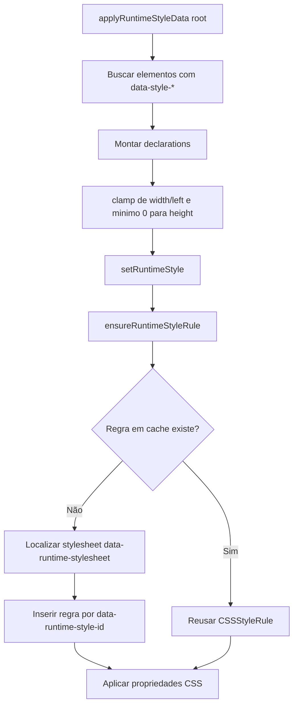

# Fluxograma — Runtime Style CSP

```mermaid
flowchart TD
  A[applyRuntimeStyleData root] --> B[Buscar elementos com data-style-*]
  B --> C[Montar declarations]
  C --> D[clamp de width/left e minimo 0 para height]
  D --> E[setRuntimeStyle]
  E --> F[ensureRuntimeStyleRule]
  F --> G{Regra em cache existe?}
  G -- Sim --> H[Reusar CSSStyleRule]
  G -- Não --> I[Localizar stylesheet data-runtime-stylesheet]
  I --> J[Inserir regra por data-runtime-style-id]
  J --> K[Aplicar propriedades CSS]
  H --> K
```

## Regra

Estilos dinâmicos são aplicados em stylesheet local para preservar compatibilidade com `style-src 'self'`.
