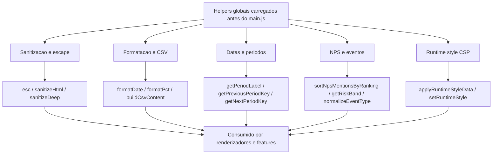

# Fluxograma — Módulo `src/utils`

## Evidências

- `src/utils/helpers.js`: comentário inicial informa carregamento antes de `main.js` e exposição no escopo global.
- O arquivo agrupa sanitização, datas, CSV, NPS, eventos e runtime style.
