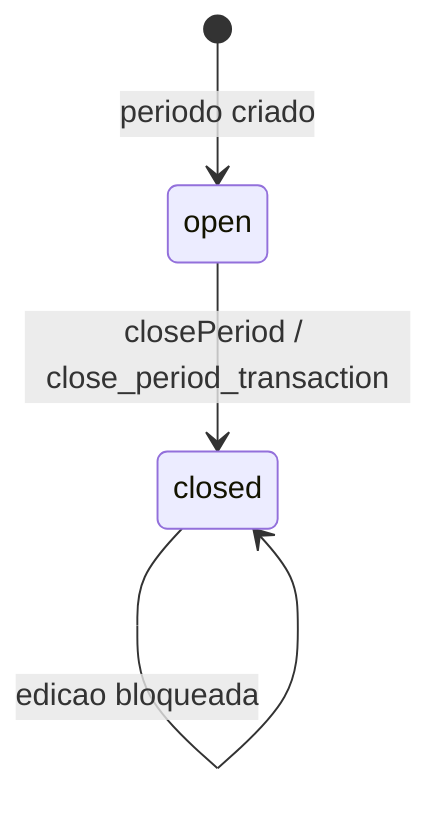
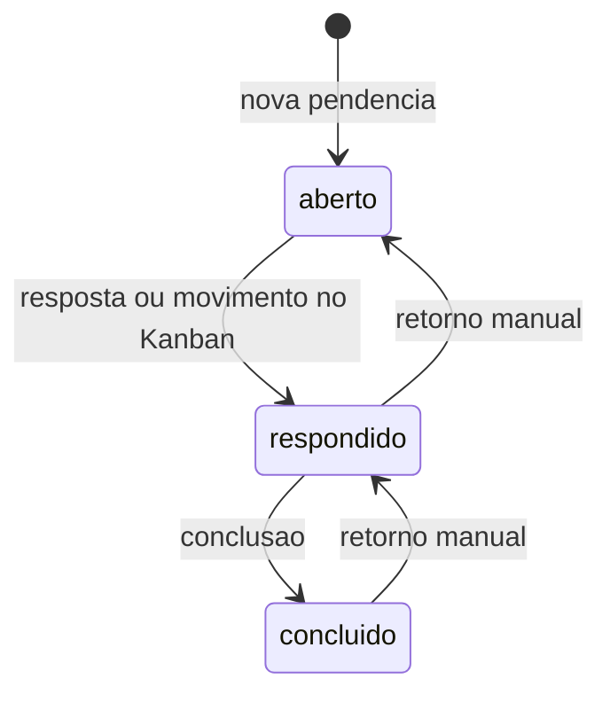
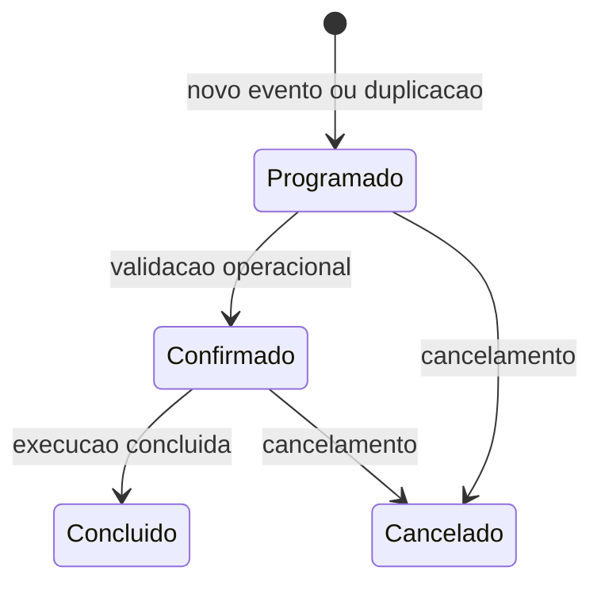
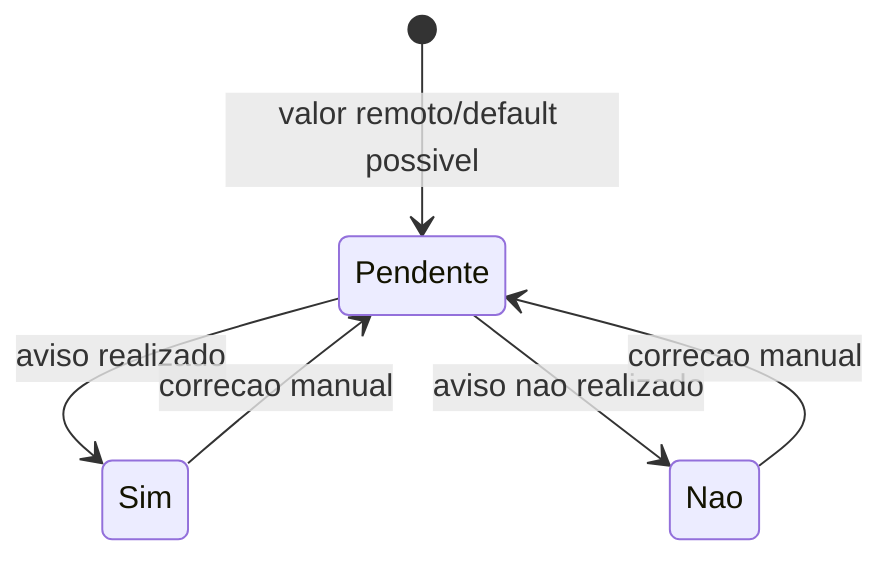
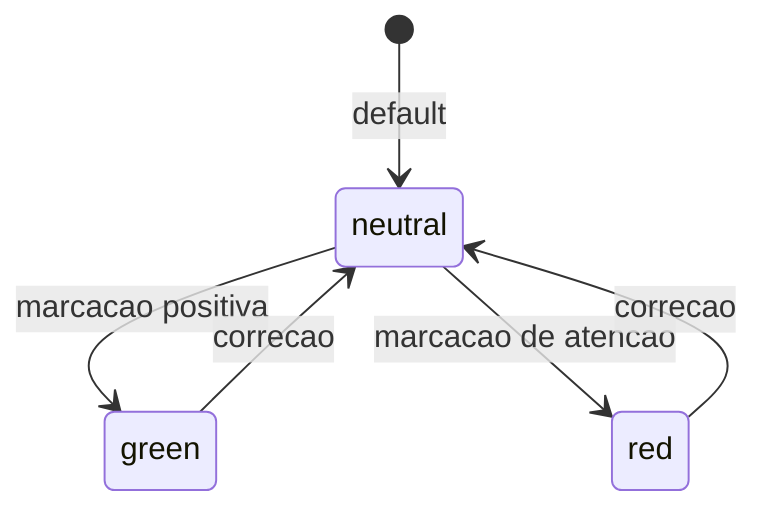
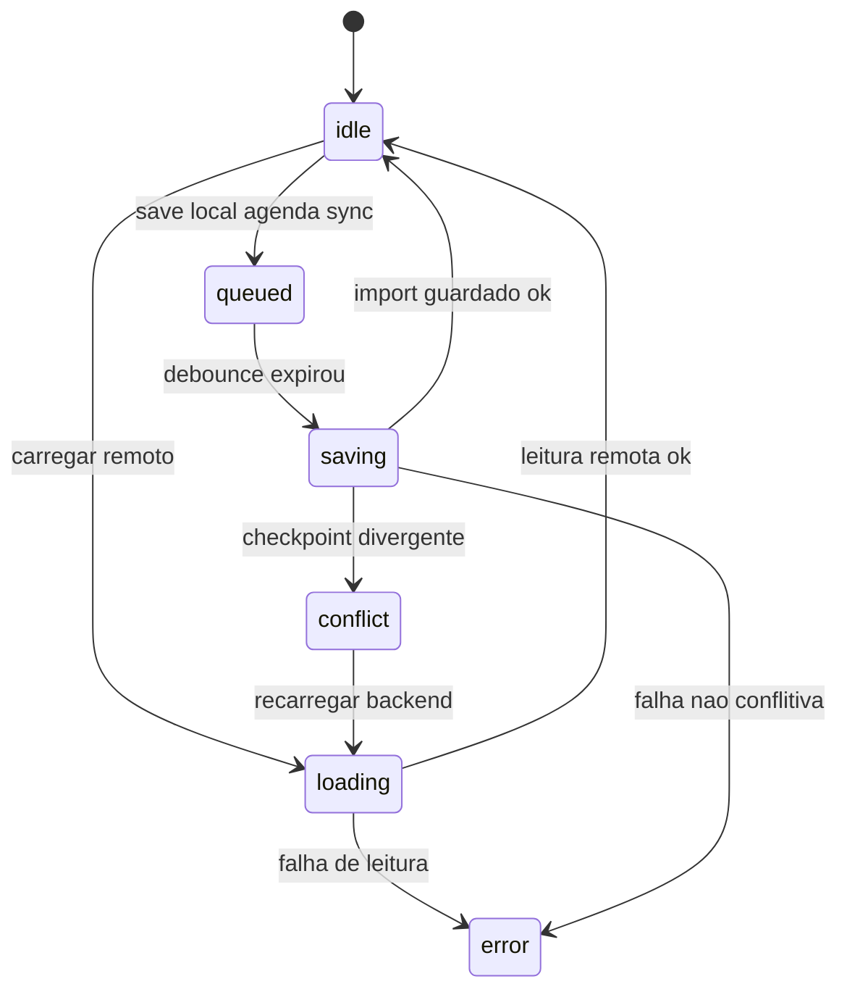
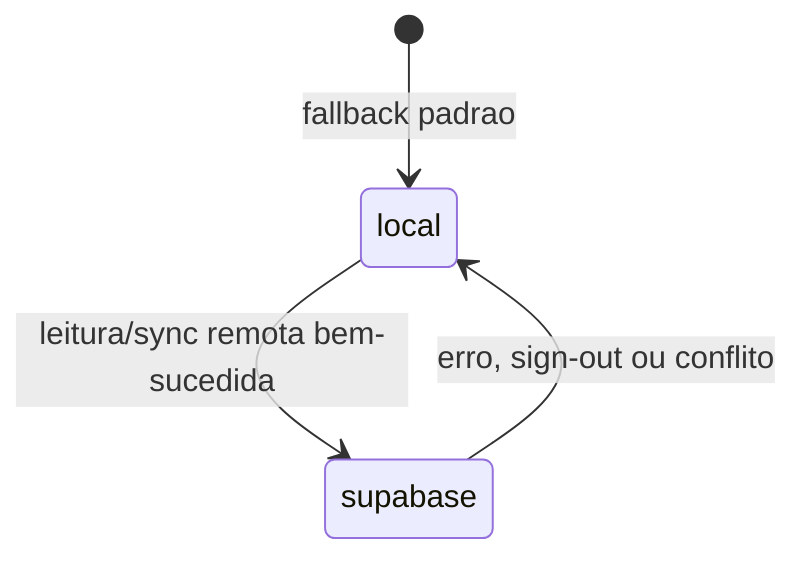

# Detective — Máquinas de Estado

Gerado em: 2026-05-02T17:42:27Z

## Período

Estados confirmados: `open`, `closed`.



| Transição | Gatilho | Regra |
|---|---|---|
| criar período | `ensurePeriod()`, bootstrap, import | período nasce aberto |
| `open` -> `closed` | fechamento mensal | exporta JSON, arquiva, bloqueia edição |
| `closed` -> edição | tentativa de ação | bloqueada por `assertWritableCurrentPeriod()` |

## Pendência

Estados confirmados: `aberto`, `respondido`, `concluido`.



🟢 **CONFIRMADO** — O teclado move status por ordem linear `aberto -> respondido -> concluido`. Drag/drop e edição também atualizam status.

## Evento / Ação

Estados confirmados no banco: `Programado`, `Confirmado`, `Concluído`, `Cancelado`.



🟡 **INFERIDO** — O código permite editar status diretamente; a ordem acima representa o fluxo operacional provável.

## Feedback de Atendimento

Estados confirmados: `Pendente`, `Respondeu`, `Não respondeu`.

```mermaid
stateDiagram-v2
  [*] --> Pendente: novo atendimento
  Pendente --> Respondeu: feedback positivo/retorno
  Pendente --> "Não respondeu": sem retorno
  Respondeu --> Pendente: correcao manual
  "Não respondeu" --> Pendente: correcao manual
```

## Aviso NPS

Estados confirmados: `Sim`, `Não`, `Pendente`.



## Linha de Escala

Estados confirmados: `green`, `red`, `neutral`.



🟡 **INFERIDO** — Os nomes indicam tom visual/operacional; o código não amarra cada cor a uma regra de negócio textual obrigatória.

## Sync Supabase

Estados confirmados: `idle`, `loading`, `queued`, `saving`, `conflict`, `error`.



## Fonte do Store

Estados confirmados: `local`, `supabase`.


